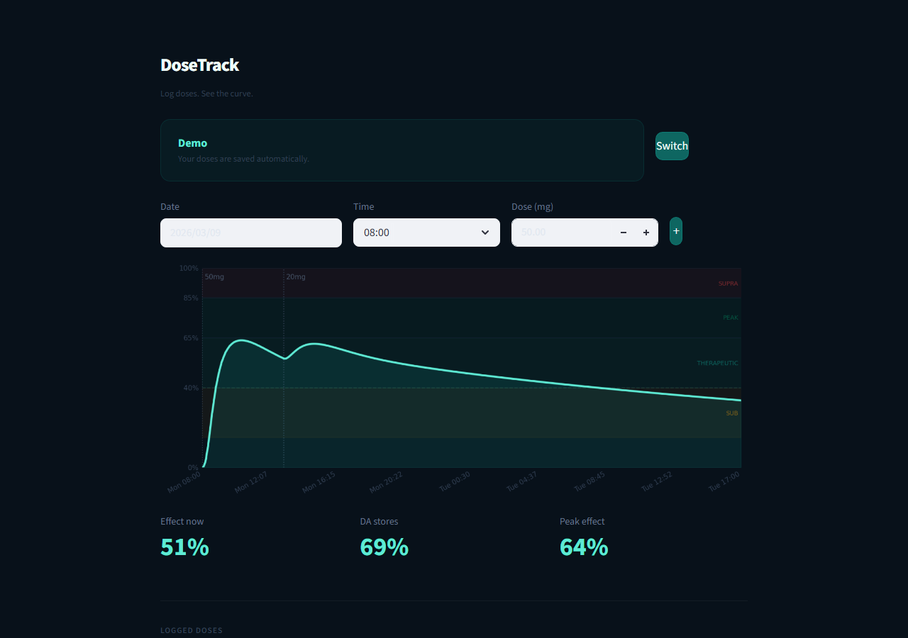

# DoseTrack V4

**Pharmacokinetic simulation for lisdexamfetamine (Vyvanse).**
Built by [dis-solved.com](https://www.dis-solved.com) — ML is the solvent.

Log doses with a date, time, and mg amount. The app simulates the full PK/PD curve in real time using the same engine as V3 — prodrug model, RK4 solver, sigmoid Emax, dopamine depletion, and acute/chronic tolerance.

Named accounts with local SQLite persistence.

---



---

## Run locally

```bash
pip install -r requirements.txt
streamlit run app.py
```

## Engine

The `dosetrack/` module is a full pharmacokinetic/pharmacodynamic simulation engine:

- **PK**: LDX → d-AMP prodrug conversion (Michaelis-Menten), 2-compartment distribution, MM elimination
- **PD**: Sigmoid Emax (Hill equation), vesicular DA depletion, acute + chronic tolerance, sleep debt
- **Solver**: Fixed-step RK4 with bolus dose injection at event times

Constants sourced from published literature (Pennick 2010, Ermer et al. 2010).

See [TECHNICAL_REPORT.md](TECHNICAL_REPORT.md) for full maths and architecture.

---

*For personal and educational use only. Not medical advice.*
